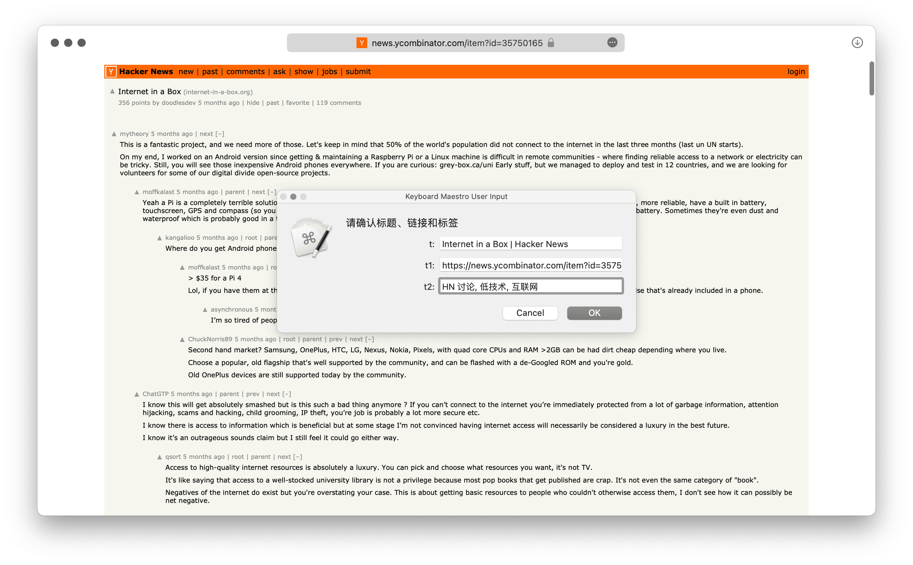

# Article Library

本动作用于搭建本地文章书签库，可收集、检索并以 Markdown 格式复制文章链接。

注意，此 Keyboard Maestro 版本仅能添加书签而不能检索，检索请考虑更合适的工具，例如 [LaunchBar 版](https://github.com/BlackwinMin/LaunchBar-gallery/tree/master/Article%20Library)或 [Automator 版](https://github.com/BlackwinMin/Automator-gallery/tree/master/Article%20Library)。

需创建文本文件用于储存数据，为照顾跨平台使用，默认位置为 iCloud 的 Shortcut 文件夹。

