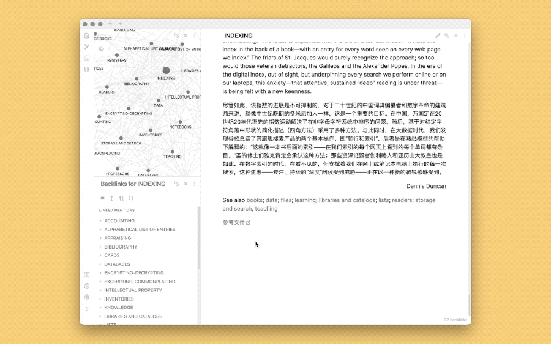

# Copy Deep Link with UUID

用于为文件生成稳定可靠的链接，即便原始文件移动或重命名，链接也不会失效。

出处文章：

- [macOS 中的阿里阿德涅之线——Deep Link - #Untag](https://utgd.net/article/4972)
- [如何一键打开 macOS 中的任何文件（以 Keyboard Maestro 为例） - #Untag](https://utgd.net/article/4988)

