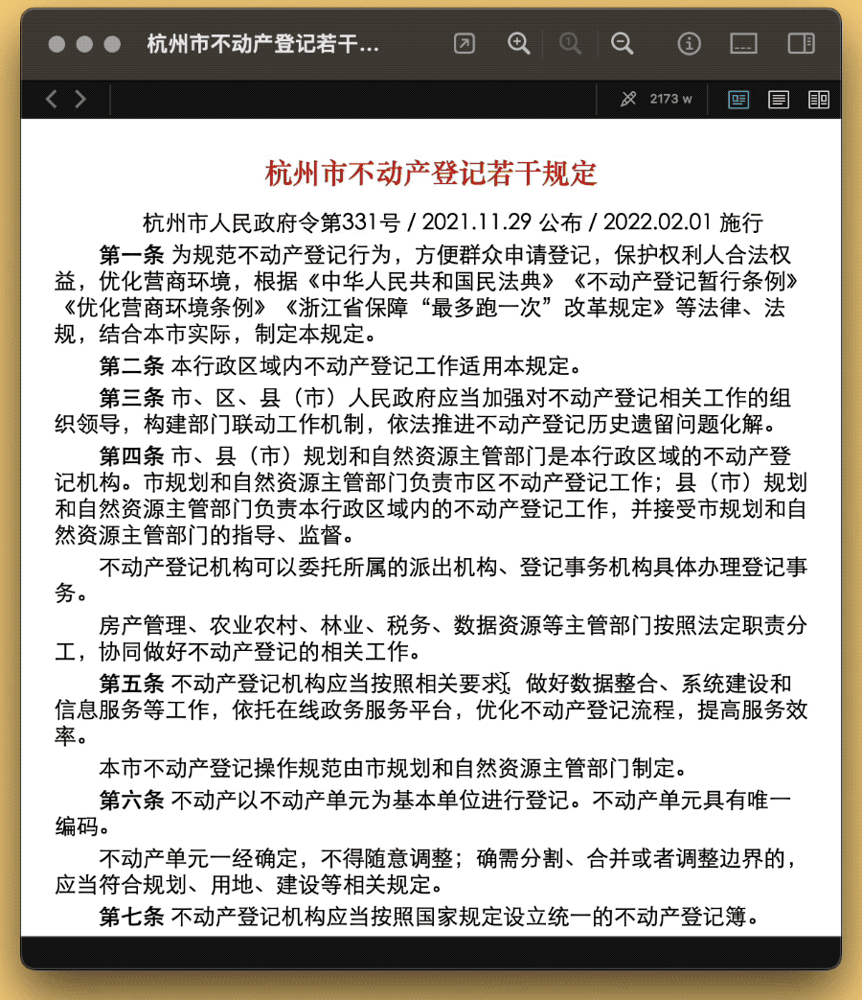

# Ctrl Go 显示原始文件

20231025更新：在 Keyboard Maestro 11 中，可通过 `%FrontDocumentPath%` Token 获取多数软件当前窗口的关联文档路径，以大大简化本动作步骤。不过，`%FrontDocumentPath%` 在 Safari 等程序中无法使用，故原方案仍有一定价值。

本方案将介绍一套显示原始文件的通用方案，适用于 macOS 上的多数软件，迨沉浸于工作之时，不必再被层层文件夹阻碍思路，只消波动几颗按键，就能访问原始文件之所在。

出处：[一键打开当前文件的原始位置（Keyboard Maestro 为例）](https://utgd.net/article/20186/)。

