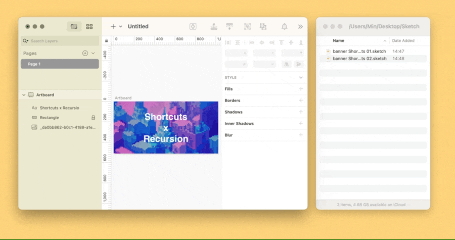

# Default Folder 为不同软件设置默认文件保存位置

为目标软件设置默认的文件保存位置，当您按下 `⌘Command-S` 保存文件时，Keyboard Maestro 会取代系统自带的文件保存窗口，代之以文件名输入框，确认后即可直接存之预设位置。

同时，如果确实需要保存到别处，我也预留了“Other Folders”按钮，点击后可以切回原生文件保存窗口，以便手动选择目标文件夹。此外，保存文件时会有种种意外，例如当前压根没有打开过文件，或者想用的文件名已被占用，这些情况都有相应提示，其设计思路请阅读原文。

示例动作是为 Sketch 设计的，如下稍作修改后，理论上也适用于**所有支持 AppleScript 的软件**：

1. 在“Prompt for User Input ‘请输入文件名’”步骤中，填写该软件最常用的文件拓展名，以降低手动填写的工作量。
2. 在“Execute AppleScript”步骤中，将 `"/Users/Min/Desktop/Sketch"` 更改为您想要使用的默认文件夹位置；如果该文件夹暂时不存在，请创建它，否则 Keyboard Maestro 会报错。
3. 将同一步骤中的 `"Sketch"` 改为目标软件；如果您修改了示例动作的名称，请将 AppleScript 脚本中的 `Default Folder` 作相应修改。
4. 在末尾两处“Select ‘Save’ in the Menu ‘File’ in Sketch”步骤中，重新确定目标软件保存文件的菜单栏项目（注意中英文，即便您目前处理的也是 Sketch，我的预设也仅适用于英文界面，中文版需重新设置）。

原文：《文件自动化（三）：为不同软件设置默认文件保存位置》（发布时间未定），拟收录于付费栏目[《Keyboard Maestro 进阶指引》](https://utgd.net/course/20340)。

