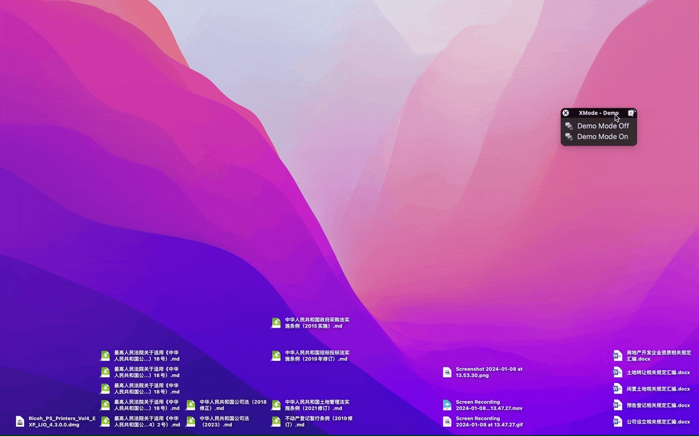

# Demo Mode On or Off

运行“Demo Mode On”，进入所谓“演示模式”（Demo Mode）：

1. 隐藏桌面上的文件；
2. 换上干净的壁纸，默认是 macOS 自带的纯色壁纸，你可能需要重新确定一下壁纸路径；
3. 把光标尺寸调到最大。

运行“Demo Mode Off”还原设置，显示桌面文件、恢复之前的壁纸并将光标尺寸调到最小（需要其他尺寸请自行调整）。

第三步仅在亮色模式下测试，如果您需要使用暗色模式，请添加一个 click on found image 模块并调整逻辑关系。

出处：《用 Keyboard Maestro 一键开启“演示模式”》，发布时间未定。

