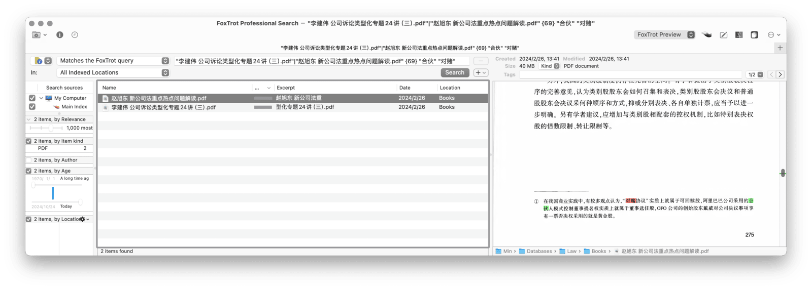

# FoxTrot Search Multi Files

在 FoxTrot 中搜索选定的复数个文件，突破默认情况下只能搜一个文件或整个文件夹的限制。当然，你需要事先索引过目标文件。

有两个版本，分别用于在 Finder 中选文件或直接在 FoxTrot 搜索结果中选文件。

出处：《FoxTrot 如何实现多文件搜索》（发布时间未定）。

另有 [LaunchBar 版](https://github.com/BlackwinMin/LaunchBar-gallery/tree/master/FoxTrot%20Search%20Multi%20Files)。

