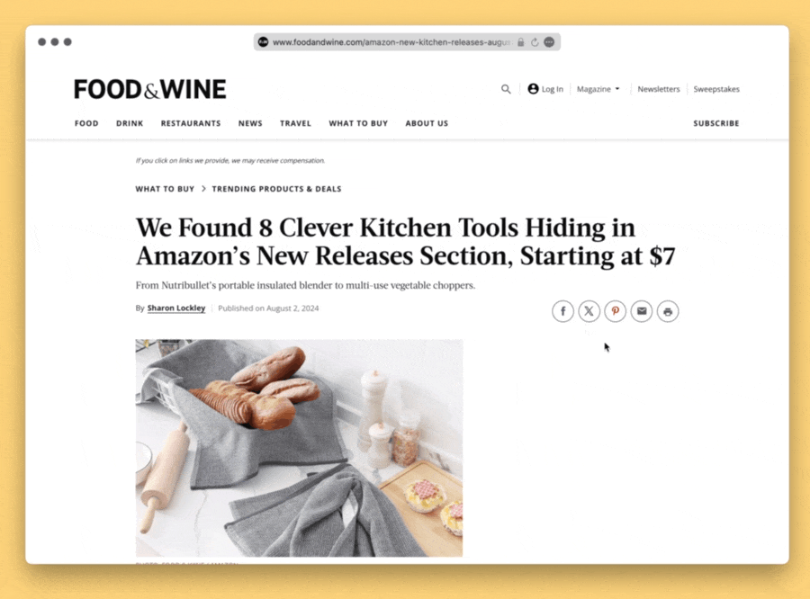

# Images Grid 为当前网页生成可点击的图片目录

一键生成缩略图矩阵，点击图片即可滚动到网页的对应位置

bookmarklet 版如下：

```
javascript:(function()%7B(function()%20%7Bconst%20images%20%3D%20document.querySelectorAll('body%20img')%3Bif%20(images.length%20%3D%3D%3D%200)%20%7Balert('No%20image')%3Breturn%3B%7Dconst%20totalImages%20%3D%20images.length%3Bconst%20cols%20%3D%20Math.ceil(Math.sqrt(totalImages))%3Bconst%20rows%20%3D%20Math.ceil(totalImages%20%2F%20cols)%3Bconst%20container%20%3D%20document.createElement('div')%3Bcontainer.style.position%20%3D%20'fixed'%3Bcontainer.style.top%20%3D%20'0'%3Bcontainer.style.left%20%3D%20'0'%3Bcontainer.style.width%20%3D%20'100%25'%3Bcontainer.style.height%20%3D%20'100%25'%3Bcontainer.style.backgroundColor%20%3D%20'rgba(0%2C%200%2C%200%2C%200.8)'%3Bcontainer.style.display%20%3D%20'flex'%3Bcontainer.style.flexWrap%20%3D%20'wrap'%3Bcontainer.style.alignItems%20%3D%20'center'%3Bcontainer.style.justifyContent%20%3D%20'center'%3Bcontainer.style.zIndex%20%3D%20'10000'%3Bcontainer.style.overflow%20%3D%20'auto'%3Bconst%20closeButton%20%3D%20document.createElement('button')%3BcloseButton.innerText%20%3D%20'Close'%3BcloseButton.style.position%20%3D%20'fixed'%3BcloseButton.style.top%20%3D%20'10px'%3BcloseButton.style.right%20%3D%20'10px'%3BcloseButton.style.padding%20%3D%20'10px'%3BcloseButton.style.backgroundColor%20%3D%20'%23fff'%3BcloseButton.style.border%20%3D%20'none'%3BcloseButton.style.cursor%20%3D%20'pointer'%3BcloseButton.style.zIndex%20%3D%20'10001'%3BcloseButton.addEventListener('click'%2C%20()%20%3D%3E%20%7Bdocument.body.removeChild(container)%3B%7D)%3Bcontainer.appendChild(closeButton)%3Bimages.forEach(img%20%3D%3E%20%7Bconst%20thumb%20%3D%20document.createElement('img')%3Bthumb.src%20%3D%20img.src%3Bthumb.style.maxWidth%20%3D%20%60calc(100%25%20%2F%20%24%7Bcols%7D%20-%2010px)%60%3Bthumb.style.maxHeight%20%3D%20%60calc(100%25%20%2F%20%24%7Brows%7D%20-%2010px)%60%3Bthumb.style.margin%20%3D%20'5px'%3Bthumb.style.cursor%20%3D%20'pointer'%3Bthumb.addEventListener('click'%2C%20()%20%3D%3E%20%7Bconst%20rect%20%3D%20img.getBoundingClientRect()%3Bwindow.scrollTo(%7Btop%3A%20rect.top%20%2B%20window.scrollY%20-%20(window.innerHeight%20%2F%202%20-%20rect.height%20%2F%202)%2Cbehavior%3A%20'smooth'%7D)%3Bdocument.body.removeChild(container)%3B%7D)%3Bcontainer.appendChild(thumb)%3B%7D)%3Bdocument.body.appendChild(container)%3B%7D)()%7D)()
```

