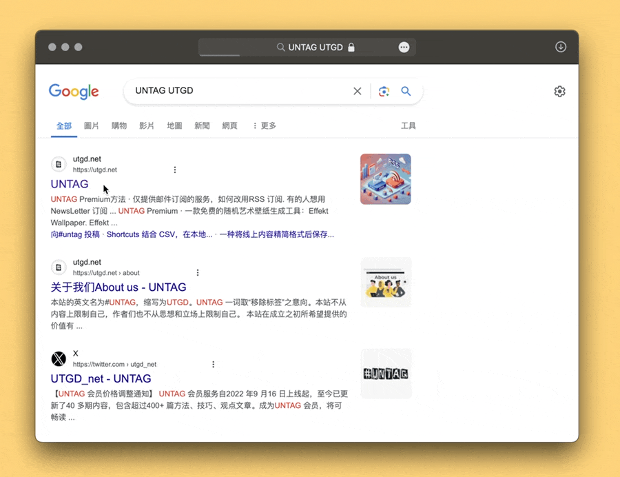

# 自动移除 Google 链接中的垃圾信息

当你从 Google 搜索结果中拷贝链接时，你想要的链接：

```
https://utgd.net/
```

你实际得到的链接：

```
https://www.google.com/url?sa=t&source=web&rct=j&opi=89978449&url=https://utgd.net/&ved=2ahUKEwif-bWwnPSGAxUprlYBHR3WDcMQFnoECA8QAQ&usg=AOvVaw1MULZ4acJAbBlrunpUflU2
```

这是什么鬼？

本动作用于从 Google 搜索结果中拷贝链接时，自动移除前后的垃圾部分。适用于几乎任何浏览器（我提供的版本默认是 Safari）。

