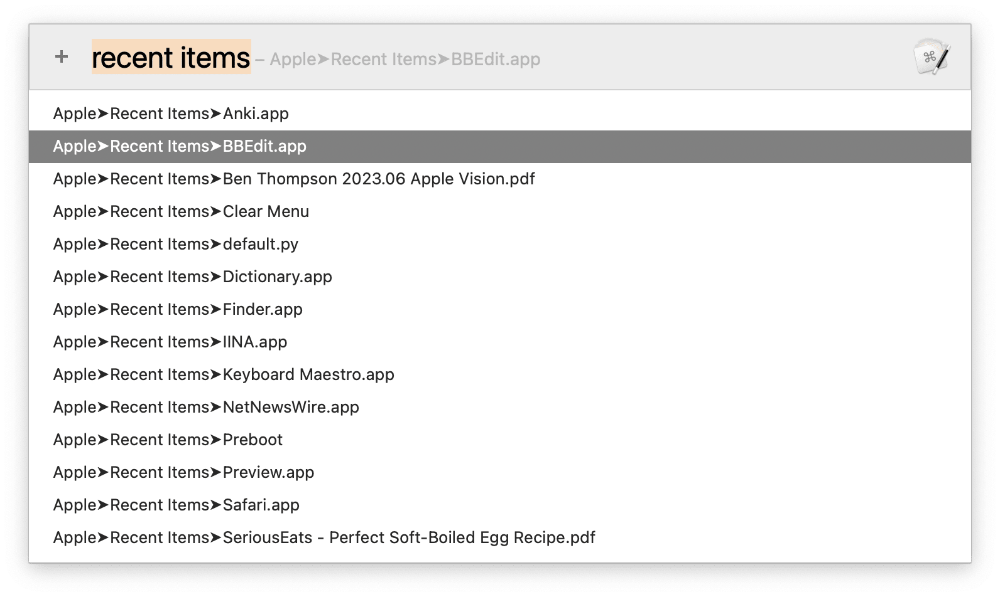

# King of Keystroke 快捷键之王

[《征服 macOS 快捷键（一）——快捷键之王》](https://utgd.net/article/10042)的 Keyboard Maestro 版，搜索当前软件菜单栏中的任意项目并快速启动，界面更宽敞，输入更方便，跨层级搜索更精确，并且能够记住搜索历史（每个 App 的历史都会分别记录）。如果你只能记住一个快捷键，或者只能掌握一个 Keyboard Maestro Macro，就是它。

请更新至 11.0.3 及更高的版本，以避免 Token 无效的 bug。参见 [How to get last selected menu item - Questions & Suggestions - Keyboard Maestro Discourse](https://forum.keyboardmaestro.com/t/how-to-get-last-selected-menu-item/35954)。

