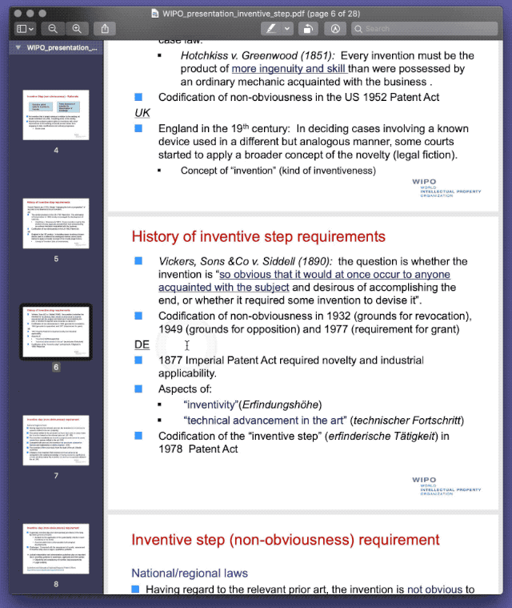

# Look Up X 查词翻译一体化解决方案

根据当前选中的内容进行查词或翻译：如选中单词，弹出系统查词界面；如选中词组或句子，弹出 Google Translate 翻译结果。

本动作需搭配 Automator Services（workflow）使用，以实现窗口弹出效果。请将 Automator 动作置于 `~/Library/Services/` 目录下。

默认提供了快捷键和鼠标中键点击两种操作方式。快捷键可直接使用，鼠标中键需重新配置 USB Device Key Trigger。

默认仅在 Preview 中启用，可以自行增加其他支持应用。

原文：Keyboard Maestro 查词翻译一体化解决方案（预计2023年11月发布）。

