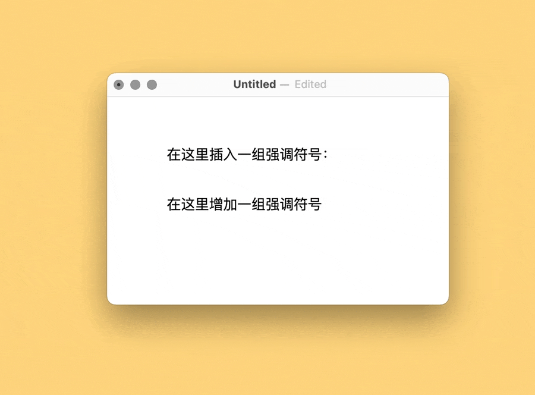
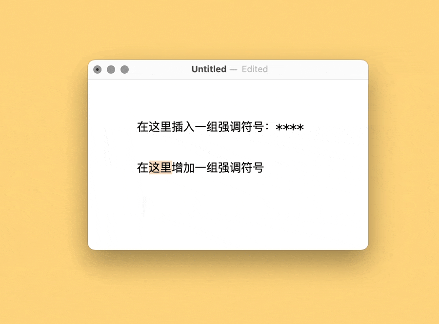

# Markdown X 用更舒服的方式输入 Markdown 符号

关于 Markdown 输入的讨论从未断绝，但是大多停留在“能够输入”的层面上，多数软件所谓的 Markdown 符号输入支持，也只是给了一堆快捷键（如 Drafts）或一排按钮（如 Ulysses），鲜有听闻谁能让 Markdown 符号输入更舒服的。而恰恰在这一貌似极其个人化而无从置喙的领域，最能看出设计师的功力——当然，也包括自动化动作的设计者。

软件开发商追求四平八稳，不敢深入太个性化的输入方式，这无可厚非。但是在按钮和快捷键之外，尚有更加自然的输入方式可供探索。这类操作并非“我就是这样觉得”或“我就喜欢”，而是在心手并用的键盘起落之间，既**确确实实减少操作量**，又**明明白白降低记忆量**。

出处：[《Keyboard Maestro Markdown 输入加速篇》](https://utgd.net/article/20931)，预计2024年10月中旬发布。

用 Keyboard Maestro 插入强调符号：

用 Keyboard Maestro 增加强调符号：

用 Keyboard Maestro 插入 code area 和 code  block：

