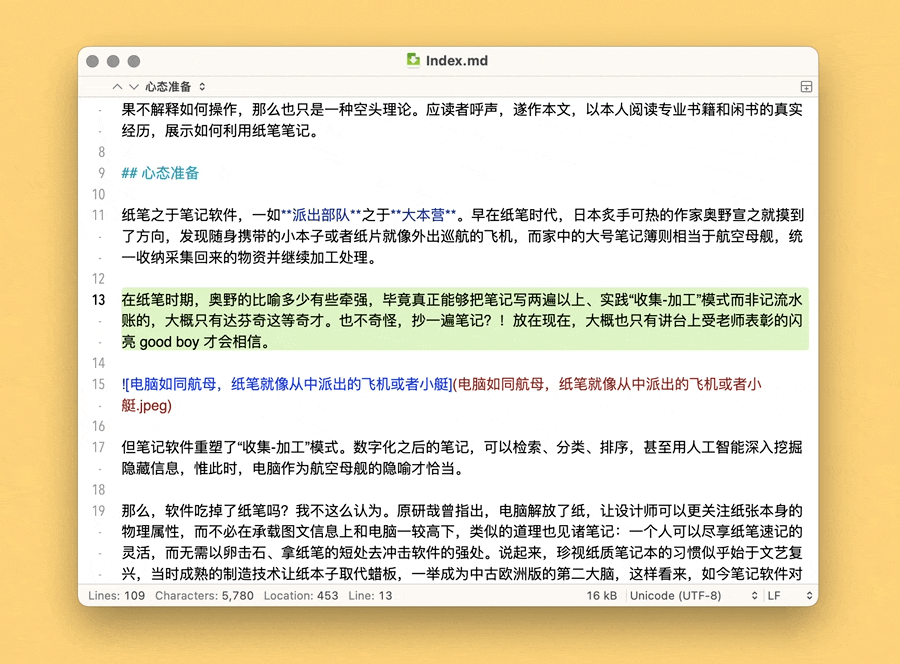
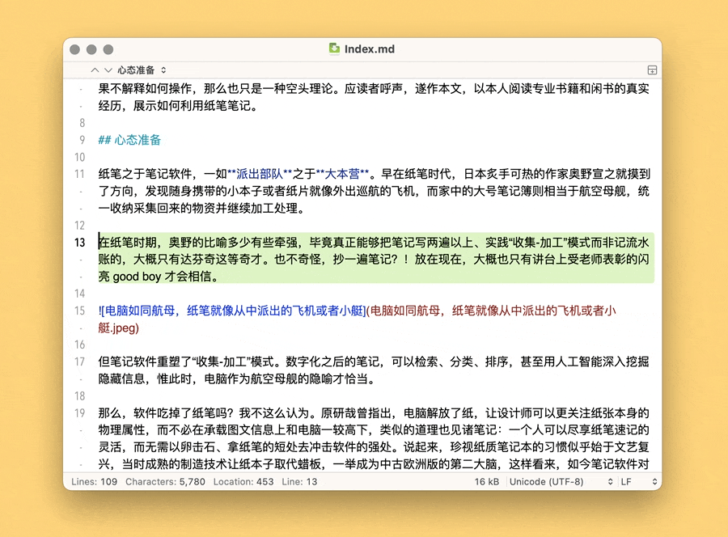
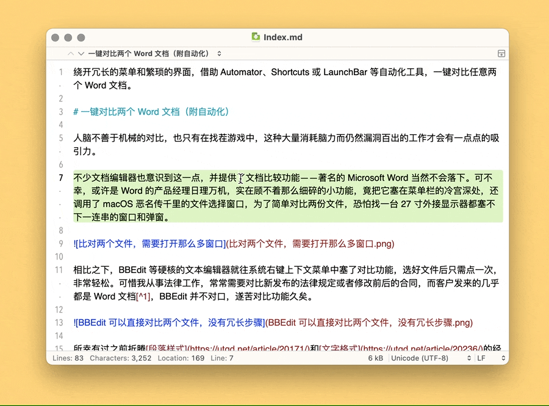

# Move Cursor or Select Text 快速移动光标或选取文本

保留以行为单位的光标移动或文本选取操作之同时，提供双击操作，以移动光标到段首段末或选取文本至段首段末：

- 移动光标到段首：双击 `⌘Command-左箭头`
- 移动光标到段末：双击 `⌘Command-右箭头`
- 复制文本到段首：双击 `⇧Shift-⌘Command-左箭头`
- 复制文本到段末：双击 `⇧Shift-⌘Command-右箭头`

出处：[《如何快速移动光标和选取文本，兼谈  Keyboard Maestro 快捷键以及全键盘党》](https://utgd.net/article/20359)，预计2024年1月末发布。

