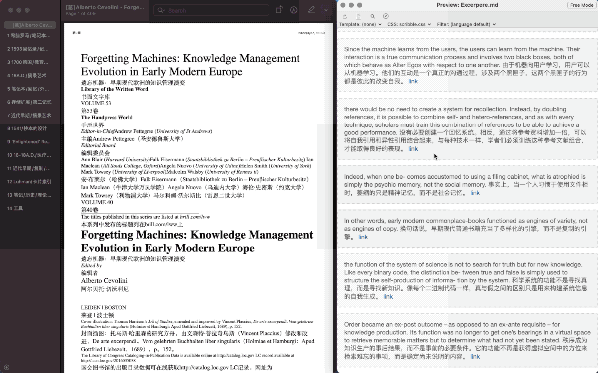

# 打开 PDF 页面链接

通过 URL Scheme 一键直达 PDF 的指定页面。即使移动 PDF 原始文件或将其重命名，依然有效。

出处：

- [用 Keyboard Maestro 制作页面链接，翻开 PDF 的任意一页（2022 年十月中旬发布）](https://utgd.net/article/8384)
- [如何一键打开 macOS 中的任何文件（以 Keyboard Maestro 为例） - #Untag](https://utgd.net/article/4988)

