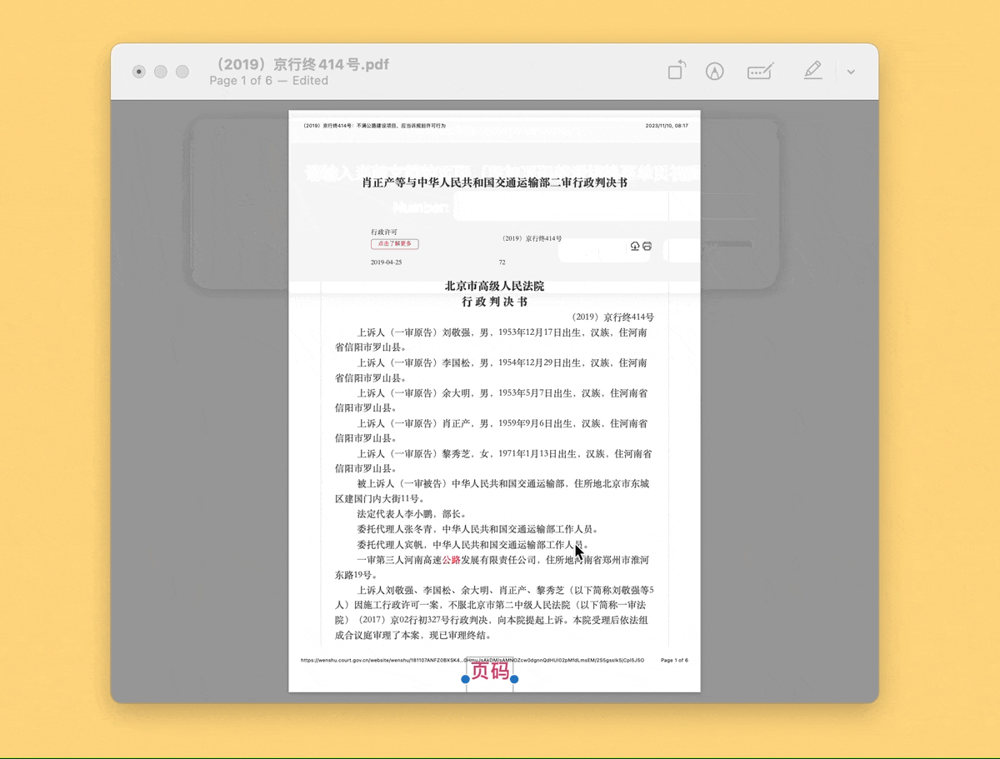
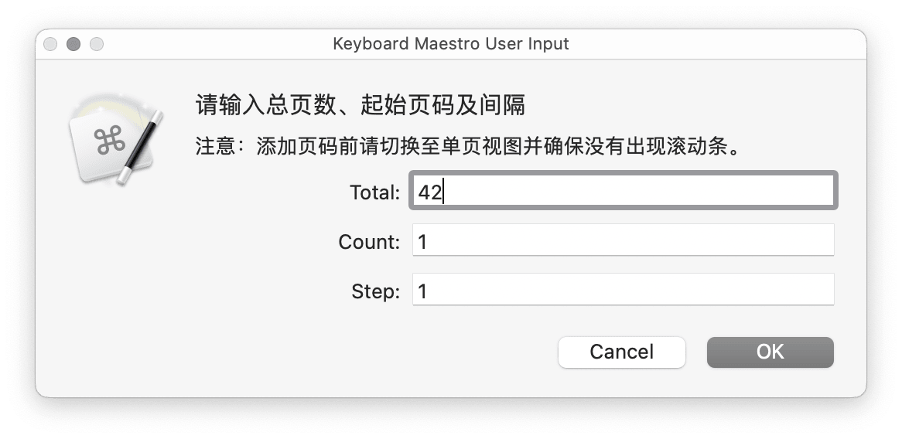

# PDF Paginate PDF加页码

macOS 是能加页码的小工具屈指可数。2023 年年底，我使用多年的 pdfPaginatePro 也在转向 iOS 套壳软件后，卡到几乎无法使用，像是开了一个套了十层的虚拟机，最终我还是将其卸载，并另寻出路。直接的产物就是本方案。

通过 GUI Scripting，在 Preview 中给 PDF 加页码。几乎可移植到任何能批注 PDF 的软件中。

原文：[《Keyboard Maestro 的蠢操作：给 PDF 添加页码》](https://utgd.net/article/20515/)，了解具体设计思路请订阅 UNTAG Premium。

v1.1 增加了起始页码和间隔选项，默认从第一页编起，间隔为一页，但是也可以自由设置，例如想从第一百零一页开始编的话，请输入 `101`。

