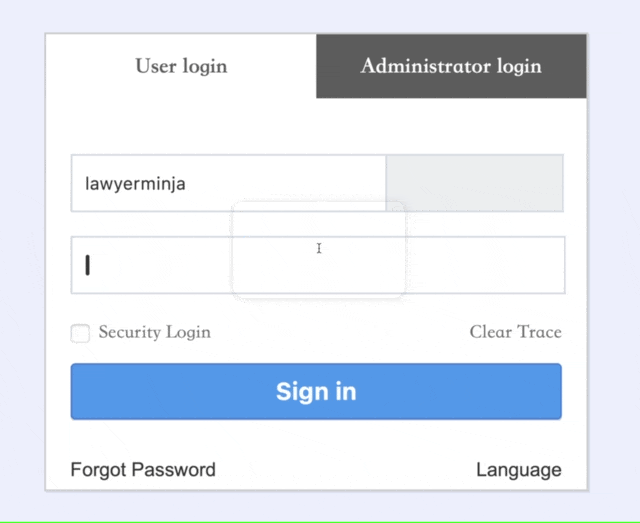

# Paste Password

快速插入密码，专治不支持自动填充的网页。需先用 Keyboard Maestro 创建密码（创建后可删除创建模块），然后在此动作中填写对应的密码名称。密码保存在钥匙串中，Keyboard Maestro 不存储密码，以确保安全。

出处：[《用 Keyboard Maestro 在浏览器中安全并快速插入密码》](https://utgd.net/article/20976)，2024年12月上旬发布。

