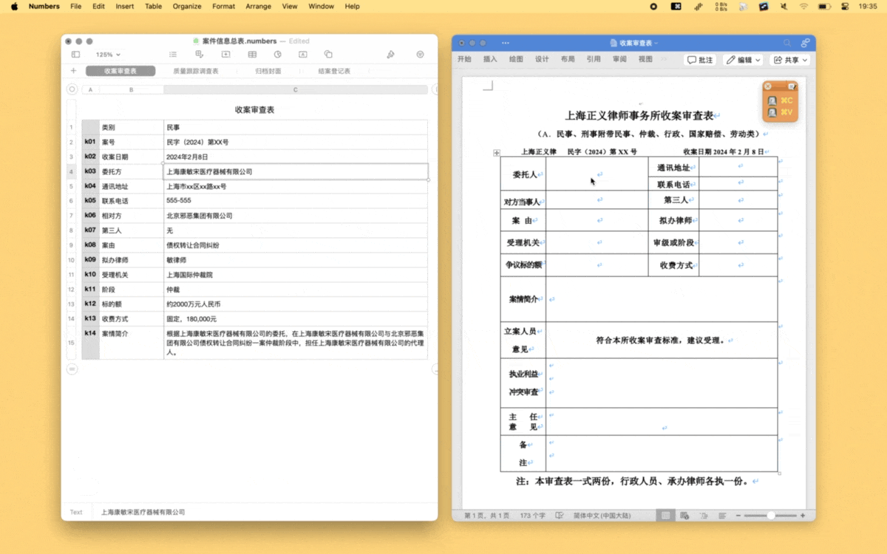

# Paste Queue 剪贴板顺序粘贴

方便在填表单或上传数据到网站后台时，通过顺序粘贴形式，一次性复制各项数据，再一口气粘上，免去来回切换。

1. 按下快捷键 `⇧Shift-⌃Control-⌥Option-⌘Command-P`，呼出 Keyboard Maestro Palette，进入顺序粘贴模式。
2. 连按 `⌘Command-C`，进行一系列复制，复制的顺序就是粘贴的顺序。
3. 连按 `⌘Command-V`，进行一系列粘贴，刚才复制的内容会按顺序粘上。
4. 再次按下快捷键 `⇧Shift-⌃Control-⌥Option-⌘Command-P`，或者直接关闭 Palette，结束顺序粘贴。

