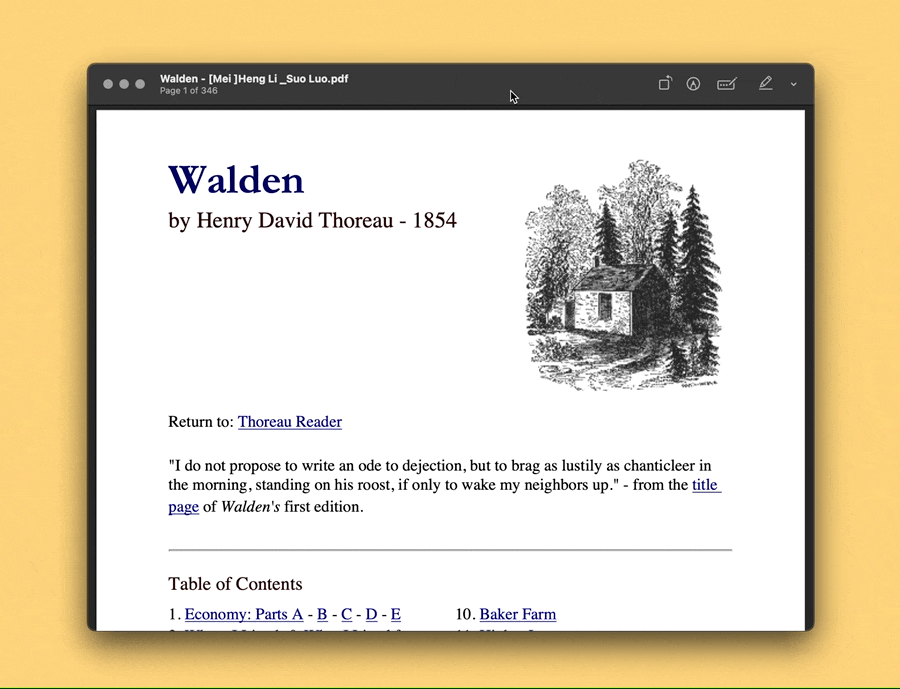

# Paste Password

重新设计预览工具的视图（显示方式）交互方式，可自行增改：

- `⌘Command-1`：切到页面视图，继续按动以在单页和连续滚动之间切换
- `⌘Command-2`：切到缩略图视图
- `⌘Command-3`：显示或隐藏书签
- `⌘Command-4`：显示或隐藏批注

出处：[《用 Keyboard Maestro 掌控 PDF 阅读视图》](https://utgd.net/article/21166/)。

