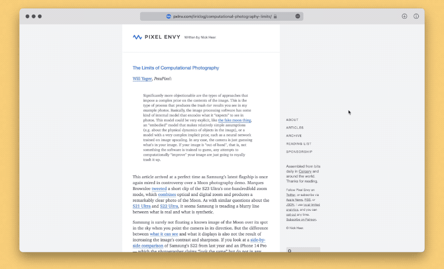

# Safari Translate V 网页左右分屏对照翻译

将网页分为左右两侧，分别显示原文和译文。比[对照翻译](https://github.com/BlackwinMin/Keyboard-Maestro-gallery/tree/master/Safari%20Translate)更鲁棒，适合阅读排版比较复杂的网页，比如带不可折叠式侧边栏的页面。

出处：[《一种长寿可靠的网页中英分屏翻译方案》](https://utgd.net/article/20131/)。

为方便没有 Keyboard Maestro 的读者，下面也提供 Bookmarklet 版本源代码。Bookmarklet 仅负责“左右分屏”，不负责“翻译”，“翻译”需要使用各个浏览器自带的翻译功能，或者使用翻译插件。我仅测试了 Safari、Chrome、Firefox 和 Edge 的自带翻译功能（20230327），没有精力一一测试其他软件，插件更是一个都没有测过，有需要的请自行测试。

```
javascript:var%20%24jscomp%3D%24jscomp%7C%7C%7B%7D%3B%24jscomp.scope%3D%7B%7D%3B%24jscomp.createTemplateTagFirstArg%3Dfunction(a)%7Breturn%20a.raw%3Da%7D%3B%24jscomp.createTemplateTagFirstArgWithRaw%3Dfunction(a%2Cb)%7Ba.raw%3Db%3Breturn%20a%7D%3Bif(!document.getElementById(%22richisminjastyle%22))%7Bvar%20t%3D%22.split%20%7B%20height%3A%20100%25%3B%20width%3A%2050%25%3B%20position%3A%20fixed%3B%20z-index%3A%201%3B%20top%3A%200%3B%20overflow-x%3A%20hidden%3B%20padding-top%3A%2020px%3B%7D%20.left%20%7B%20left%3A%200%3B%7D%20.right%20%7B%20right%3A%200%3B%7D%22%2Cnewstyle%3Ddocument.createElement(%22style%22)%3Bnewstyle.id%3D%22richisminjastylepurple%22%3Bnewstyle.innerHTML%3Dt%3Bdocument.head.appendChild(newstyle)%7Ddocument.body.outerHTML%3D%22%3Cdiv%20class%3D'split%20left'%3E%22%2Bdocument.body.outerHTML%2B%22%3C%2Fdiv%3E%3Cdiv%20%20translate%3D'no'%20class%3D'split%20right'%3E%22%2Bdocument.body.outerHTML%2B%22%3C%2Fdiv%3E%22%3Bvoid+0
```

