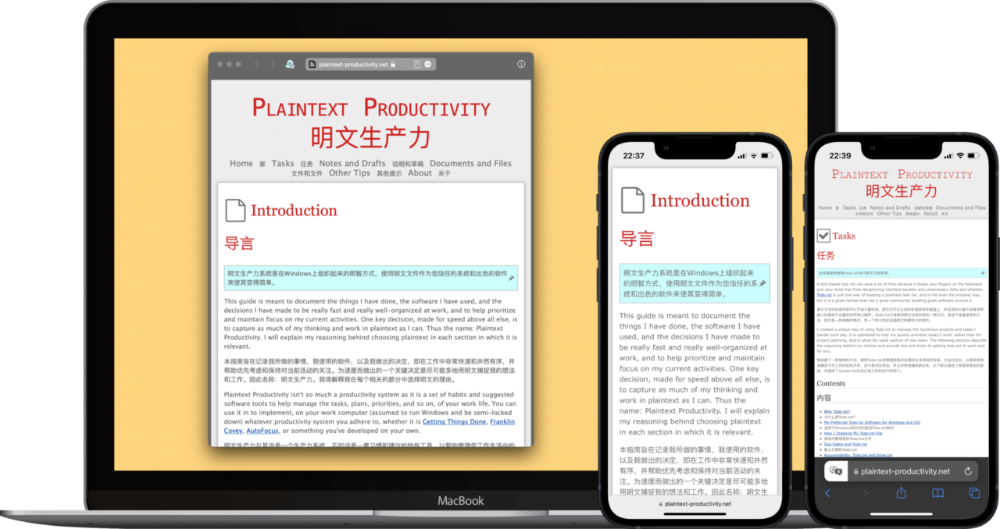

# Safari Translate 网页对照翻译

最理想的网页翻译效果，恐怕就是一段原文一段译文，如此既不妨碍阅读，也能够对照原文，避免错漏。专于这一功能的工具偶有复现，但要么难以为继，要么转为封闭的软件并且坐收买路钱（在此就不点名了，毕竟挣钱并不寒碜）。本方案将“对照”和“翻译”分开，模块化操作，更为鲁棒。

- 1.0：原始版本；
- 1.1：由会员 @Felz33 修改，可以保留原始文本的样式；
- 1.2：适配了部分论坛，比如 Zettelkasten forum；
- 1.3：适配了 XHTML 文件，可以翻译某些网站下载的 EPUB 和论文了。

系列文章：

- [《一种几乎永不失效的网页中英对照翻译方案》](https://utgd.net/article/4991)：最基础的对照翻译方案，支持网页和 HTML/XHTML 文件，是下面所有方案的基础。
- [《用 Safari 翻译外文电子书和文档》](https://utgd.net/article/6901)：对照翻译电子书，输出双语 PDF 或 Word 文档，目前该方案已经被下一项取代，毕竟你可以随时把 EPUB 转换成 PDF，但不能反过来操作。
- [《将外文电子书翻译成双语对照版本，并在任何设备上阅读》](https://utgd.net/article/10001)：对照翻译电子书，输出双语 EPUB，已经取代输出 PDF 的旧方案。
- [《在 DEVONthink 中对照翻译外文 Newsletter》](https://utgd.net/article/10005)：在 DEVONthink 中翻译 Newsletter。
- [《UNTAG Premium 第九期》](https://utgd.net/article/9628)：适配了部分论坛页面。
- [《UNTAG Premium 年度特辑 01》](https://utgd.net/article/9760)：全文翻译 DEVONthink 中的 RSS 文章（前提是你订阅的 RSS 源了你全文）。

