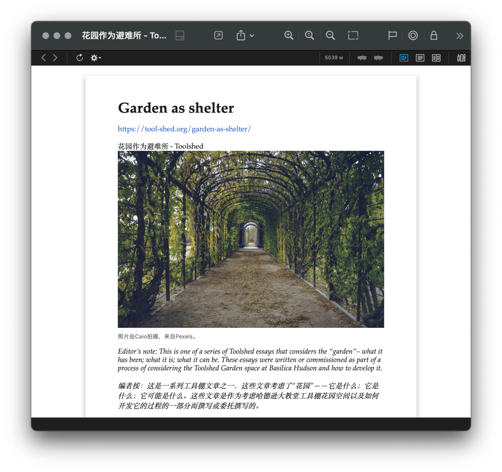

# Safari to clutter free HTML

Update 20231027：改用时间戳而非网页标题作为文件名，避免各种边际问题。另，开头新增选取网页主体颜色的步骤，制作出来的 HTML 更符合网页原风格。

Update 20221021：用 Javascript 重写了一部分操作，降低了对 GUI Scripting 的依赖；运行结束后会自动退出检查器页面。现在运行超快的 :D

用 [Keyboard Maestro](https://www.keyboardmaestro.com/main/) 从 Safari 获得阅读模式的 HTML 文件，以便剪藏到本地保存。后续可以配合 [DEVONthink](https://www.devontechnologies.com/apps/devonthink) 或其他工具将 HTML 转换为在 PDF，以便阅读和批注。

遇到外文网页时，可以配合 [一种几乎永不失效的网页中英对照翻译方案 - #Untag](https://utgd.net/article/4991)，先获得中英对照翻译的页面，再剪藏到本地。

出处文章：

- [一种将线上内容精简格式后保存到本地的方法 - #Untag](https://utgd.net/article/8492)
- [剪藏网页到本地的自动化思路（以 Keyboard Maestro 为例）](https://utgd.net/article/8609)

