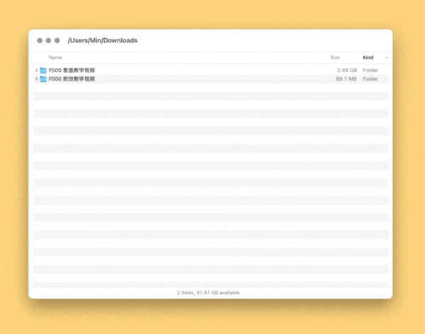

# Show View Option X 正常地关闭 Finder 显示方式窗口

当你想关闭显示方式窗口时，聪明的设计师帮你关掉了 Finder 窗口。用 Keyboard Maestro 把他掰直。

需同时安装主 Macro 和 Helper Macro，平时请保持 Helper 禁用，交由主 Macro 调用。

出处：《以脑筋正常的方式关闭 Finder 显示方式窗口》，发布时间未定。

