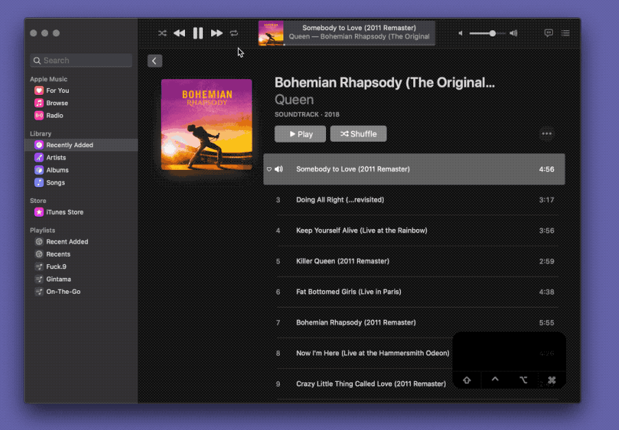

# Switch iTunes Repeat Mode

Turn `⌘Command-1` into a repeat mode button. Repeat all while repeat mode is one and repeat current song when repeat mode is all, of course, with the same keyboard shortcut.

