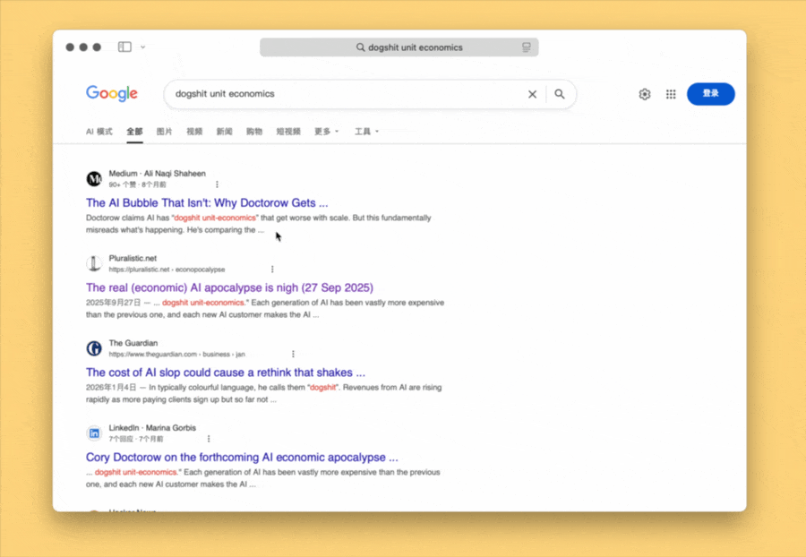

# Text Big Bang 文本大爆炸

模仿“大爆炸”的文本选取交互方式，方便从一丛文本中精确选中目标。支持多选。

尤其适合无法用光标正常点选的链接文本。

纯 AppleScript，欢迎移植（其实就是我懒得同时维护多个自动化工具版本了，你自己找 LLM 去吧）。

出处：[《文字大爆炸之二：又快又准无干扰选取文本》](https://utgd.net/article/21361)。

