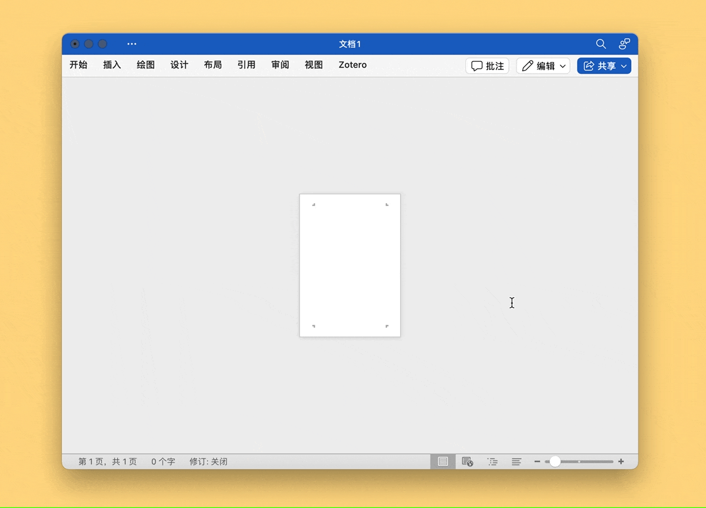

# Word Insert PDF

向 Microsoft Word 中插入扫描版 PDF 文件。需先将 PDF 拆为单页的图片，然后使用此动作。

另附代码，以供移植到 Keyboard Maestro 之外的软件：

```
tell application "Microsoft Word"
	set chosenFolder to choose folder with prompt "请选择一个文件夹："
end tell

set folderPath to POSIX file (POSIX path of chosenFolder)

tell application "Finder"
	set imageFiles to every file of folder folderPath whose name extension is "jpg" or name extension is "png" or name extension is "jpeg"
	set imageFiles to sort imageFiles by name
end tell

tell application "Microsoft Word"
	tell active document
		repeat with imgFile in imageFiles
			set imgPath to (folderPath as text) & (name of imgFile)
			make new inline picture at end of text object of active document with properties {file name:imgPath}
		end repeat
	end tell
end tell
```

出处：《如何向 Word 中插入扫描版 PDF 文件》（预计2024年12月发布）。

