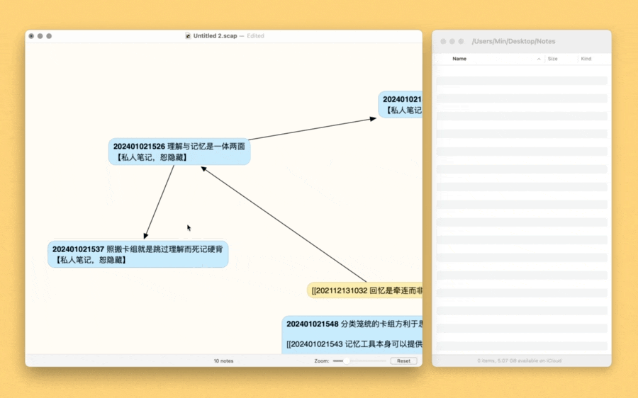

# Zettelkasten Export Note

本工具为非卡片笔记编辑器设计，例如思维导图软件或画布工具，方便从这类工具快速导出初稿到笔记库。换言之，你可以先在画布上写初稿，排布顺序、组织逻辑，大概成稿后，再快速导出。

默认以所选内容第一行为标题，剩余内容为正文。使用前请先根据您的实际情况修改笔记存储位置。

兼容 Obsidian、Logseq、FSNotes 或 nvALT 等开放文件存储的笔记软件，显然，完全没考虑 Roam Research 等封闭软件。

出处：[《卡片笔记实践篇：用画布梳理思路》](https://utgd.net)，发布时间未定。另有插入链接的动作，见 [Zettelkasten Insert Link](https://github.com/BlackwinMin/Keyboard-Maestro-gallery/tree/master/Zettelkasten%20Insert%20Link)。

