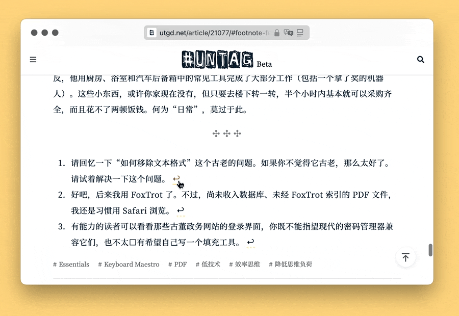

# js Footnotes to Endnotes 隐藏脚注

> 一些读者喜欢反思性的“顺便说一句”离题。其他人谴责他们是对手头的干扰。在这本书中，我向批评者鞠躬，将我的离题驱逐到尾注，甚至从文本中删除所有尾注参考编号。相反，尾注由页码和识别句子锚定。转向那些喜欢“顺便说一句”反思的人，也许他们可能会阅读一些尾注来娱乐，无论他们从哪个点离题。——Richard Dawkins

隐藏文章中的脚注符号，但不影响点击尾注回到原文位置。

