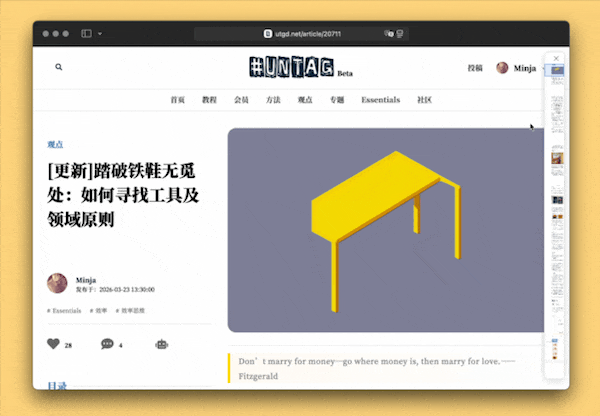

# minimap 网页迷你地图

在当前网页上显示一个 minimap 浮窗，一览网页全貌，辅助导航。

纯 Javascript，在 Safari 26.2 中测试有效，理论上也兼容多数现代浏览器。

缩略图中的图文排版可能会穿模，但不影响大局，如果介意，请自行完善。

出处：[《给网页做个 minimap，一览全局、轻松跳转》](https://utgd.net/article/21341)。



```
(async () => {
  const EXISTING = document.getElementById("__page_minimap_root__");
  if (EXISTING) EXISTING.remove();

  function wait(ms) {
    return new Promise(resolve => setTimeout(resolve, ms));
  }

  async function loadHtml2Canvas() {
    if (window.html2canvas) return window.html2canvas;

    const src = "https://cdn.jsdelivr.net/npm/html2canvas@1.4.1/dist/html2canvas.min.js";
    await new Promise((resolve, reject) => {
      const s = document.createElement("script");
      s.src = src;
      s.async = true;
      s.onload = resolve;
      s.onerror = () => reject(new Error("html2canvas 加载失败"));
      document.head.appendChild(s);
    });

    if (!window.html2canvas) {
      throw new Error("html2canvas 不可用");
    }
    return window.html2canvas;
  }

  function getScrollRoot() {
    return document.scrollingElement || document.documentElement;
  }

  function getPageWidth() {
    const de = document.documentElement;
    const b = document.body || { scrollWidth: 0, offsetWidth: 0 };
    return Math.max(
      window.innerWidth,
      de.scrollWidth,
      de.offsetWidth,
      b.scrollWidth,
      b.offsetWidth
    );
  }

  function getPageHeight() {
    const de = document.documentElement;
    const b = document.body || { scrollHeight: 0, offsetHeight: 0 };
    return Math.max(
      window.innerHeight,
      de.scrollHeight,
      de.offsetHeight,
      b.scrollHeight,
      b.offsetHeight
    );
  }

  function clamp(n, min, max) {
    return Math.max(min, Math.min(max, n));
  }

  const MINIMAP_MAX_WIDTH = 140;
  const MINIMAP_MIN_WIDTH = 36;
  const PANEL_TOP = 12;
  const PANEL_RIGHT = 12;
  const PANEL_BG = "rgba(255,255,255,0.96)";
  const PANEL_BORDER = "rgba(0,0,0,0.16)";
  const VIEWPORT_BG = "rgba(66,133,244,0.16)";
  const VIEWPORT_BORDER = "rgba(66,133,244,0.9)";

  function getPanelMaxHeight() {
    return Math.max(120, window.innerHeight - 24);
  }

  function getHeadHeight() {
    return 28;
  }

  function getAdaptiveMinimapSize(sourceWidth, sourceHeight) {
    const maxBodyHeight = Math.max(60, getPanelMaxHeight() - getHeadHeight());

    let width = MINIMAP_MAX_WIDTH;
    let height = Math.round((sourceHeight / sourceWidth) * width);

    if (height > maxBodyHeight) {
      const ratio = maxBodyHeight / height;
      width = Math.max(MINIMAP_MIN_WIDTH, Math.floor(width * ratio));
      height = Math.round((sourceHeight / sourceWidth) * width);
    }

    if (height > maxBodyHeight) {
      height = maxBodyHeight;
    }

    return { width, height };
  }

  const root = document.createElement("div");
  root.id = "__page_minimap_root__";
  root.style.cssText = `
    position: fixed;
    top: ${PANEL_TOP}px;
    right: ${PANEL_RIGHT}px;
    z-index: 2147483647;
    width: ${MINIMAP_MAX_WIDTH}px;
    font: 12px/1.2 -apple-system,BlinkMacSystemFont,Segoe UI,Roboto,sans-serif;
    user-select: none;
  `;

  const panel = document.createElement("div");
  panel.style.cssText = `
    position: relative;
    width: 100%;
    border: 1px solid ${PANEL_BORDER};
    border-radius: 10px;
    background: ${PANEL_BG};
    box-shadow: 0 4px 18px rgba(0,0,0,0.14);
    overflow: hidden;
    backdrop-filter: blur(4px);
  `;

  const head = document.createElement("div");
  head.style.cssText = `
    display: flex;
    align-items: center;
    justify-content: flex-end;
    height: 28px;
    padding: 0 6px;
    border-bottom: 1px solid rgba(0,0,0,0.08);
    background: rgba(255,255,255,0.7);
  `;

  const closeBtn = document.createElement("button");
  closeBtn.type = "button";
  closeBtn.textContent = "×";
  closeBtn.style.cssText = `
    appearance: none;
    border: 0;
    background: transparent;
    width: 24px;
    height: 24px;
    margin: 0;
    padding: 0;
    cursor: pointer;
    font-size: 18px;
    line-height: 24px;
    color: rgba(0,0,0,0.62);
    border-radius: 6px;
    flex: 0 0 auto;
  `;
  closeBtn.onmouseenter = () => {
    closeBtn.style.background = "rgba(0,0,0,0.06)";
    closeBtn.style.color = "rgba(0,0,0,0.86)";
  };
  closeBtn.onmouseleave = () => {
    closeBtn.style.background = "transparent";
    closeBtn.style.color = "rgba(0,0,0,0.62)";
  };

  const bodyWrap = document.createElement("div");
  bodyWrap.style.cssText = `
    position: relative;
    width: 100%;
    overflow: hidden;
    cursor: pointer;
    background: #fff;
  `;

  const status = document.createElement("div");
  status.textContent = "正在生成长截图…";
  status.style.cssText = `
    position: absolute;
    inset: 0;
    display: flex;
    align-items: center;
    justify-content: center;
    padding: 10px;
    color: rgba(0,0,0,0.65);
    background: rgba(255,255,255,0.88);
    text-align: center;
    z-index: 2;
  `;

  const shotCanvas = document.createElement("canvas");
  shotCanvas.style.cssText = `
    display: block;
    width: 100%;
    height: auto;
  `;

  const viewport = document.createElement("div");
  viewport.style.cssText = `
    position: absolute;
    left: 0;
    right: 0;
    box-sizing: border-box;
    border: 1px solid ${VIEWPORT_BORDER};
    background: ${VIEWPORT_BG};
    pointer-events: none;
    z-index: 1;
  `;

  head.appendChild(closeBtn);
  bodyWrap.appendChild(shotCanvas);
  bodyWrap.appendChild(viewport);
  bodyWrap.appendChild(status);
  panel.appendChild(head);
  panel.appendChild(bodyWrap);
  root.appendChild(panel);
  document.body.appendChild(root);

  let destroyed = false;
  let dragging = false;
  let sourceCanvas = null;

  function applyPanelWidth(width) {
    root.style.width = `${width}px`;
  }

  function redrawMinimap() {
    if (!sourceCanvas || destroyed) return;

    const { width: targetWidth, height: targetHeight } =
      getAdaptiveMinimapSize(sourceCanvas.width, sourceCanvas.height);

    applyPanelWidth(targetWidth);

    shotCanvas.width = targetWidth;
    shotCanvas.height = targetHeight;
    bodyWrap.style.height = `${targetHeight}px`;

    const ctx = shotCanvas.getContext("2d");
    ctx.clearRect(0, 0, targetWidth, targetHeight);
    ctx.drawImage(sourceCanvas, 0, 0, targetWidth, targetHeight);

    updateViewport();
  }

  function destroy() {
    destroyed = true;
    window.removeEventListener("scroll", updateViewport, true);
    window.removeEventListener("resize", onResize, true);
    window.removeEventListener("mousemove", onMouseMove, true);
    window.removeEventListener("mouseup", onMouseUp, true);
    root.remove();
  }

  closeBtn.addEventListener("click", destroy);

  function updateViewport() {
    const pageHeight = getPageHeight();
    const canvasHeight = shotCanvas.getBoundingClientRect().height || shotCanvas.height || 1;
    const scale = canvasHeight / pageHeight;
    const top = window.scrollY * scale;
    const h = Math.max(window.innerHeight * scale, 14);
    viewport.style.top = `${top}px`;
    viewport.style.height = `${h}px`;
  }

  function jumpTo(clientY) {
    const rect = shotCanvas.getBoundingClientRect();
    const y = clamp(clientY - rect.top, 0, rect.height);
    const ratio = y / rect.height;
    const scrollRoot = getScrollRoot();
    const maxScroll = Math.max(0, scrollRoot.scrollHeight - window.innerHeight);
    scrollRoot.scrollTo({
      top: ratio * maxScroll,
      behavior: "auto"
    });
  }

  function onMouseMove(e) {
    if (!dragging || destroyed) return;
    jumpTo(e.clientY);
  }

  function onMouseUp() {
    dragging = false;
  }

  function onResize() {
    redrawMinimap();
  }

  bodyWrap.addEventListener("mousedown", e => {
    if (e.target === closeBtn) return;
    dragging = true;
    jumpTo(e.clientY);
    e.preventDefault();
  });

  bodyWrap.addEventListener("click", e => {
    if (e.target === closeBtn) return;
    jumpTo(e.clientY);
    e.preventDefault();
  });

  window.addEventListener("mousemove", onMouseMove, true);
  window.addEventListener("mouseup", onMouseUp, true);
  window.addEventListener("scroll", updateViewport, true);
  window.addEventListener("resize", onResize, true);

  try {
    const html2canvas = await loadHtml2Canvas();

    const originalX = window.scrollX;
    const originalY = window.scrollY;

    status.textContent = "正在等待图片稳定…";
    await wait(300);

    const pageWidth = getPageWidth();
    const pageHeight = getPageHeight();

    sourceCanvas = await html2canvas(document.body, {
      backgroundColor: "#ffffff",
      useCORS: true,
      allowTaint: true,
      logging: false,
      scale: 1,
      width: pageWidth,
      height: pageHeight,
      windowWidth: pageWidth,
      windowHeight: pageHeight,
      scrollX: 0,
      scrollY: 0
    });

    if (destroyed) return;

    redrawMinimap();

    window.scrollTo(originalX, originalY);
    updateViewport();
    status.remove();
  } catch (err) {
    console.error(err);
    status.textContent = "长截图生成失败";
    bodyWrap.style.height = "220px";
    applyPanelWidth(MINIMAP_MAX_WIDTH);
  }
})();
```