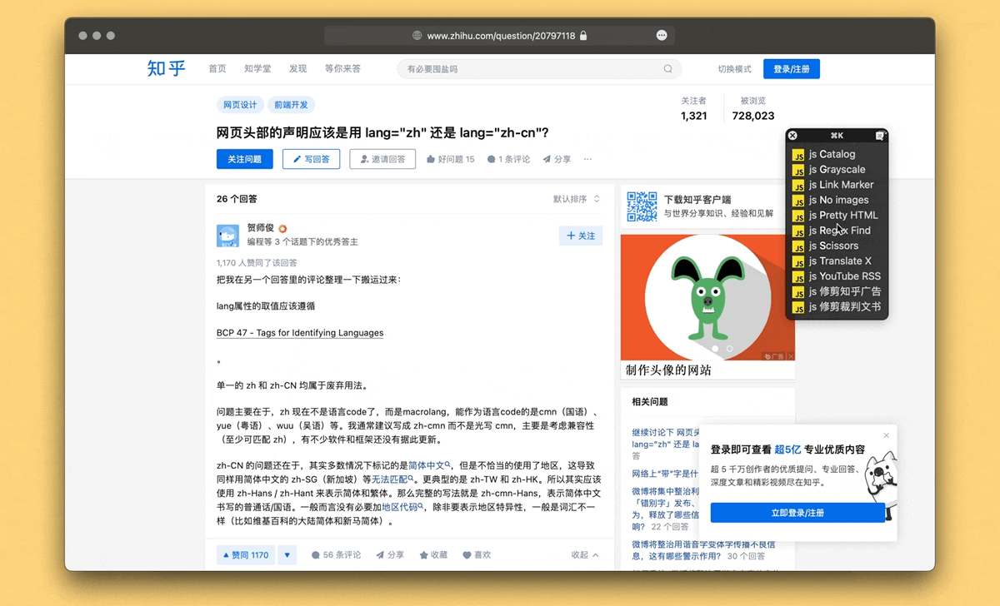

# 一键清理知乎广告

删除知乎问题页面上的广告，并微调排版以更适合阅读。主要为 Safari 设计，因为 Safari 的插件资源不多，而且此类容易失效——针对网页设计的工具，只要网页一改，自然就可能失效——的工具，最好设计成最简单的样子，以供使用者自己轻松调整、适配新的页面。

出处：[《在 Safari 浏览器中一键清理知乎网页广告（附 Keyboard Maestro 自动化）》](https://utgd.net/article/20389)。

