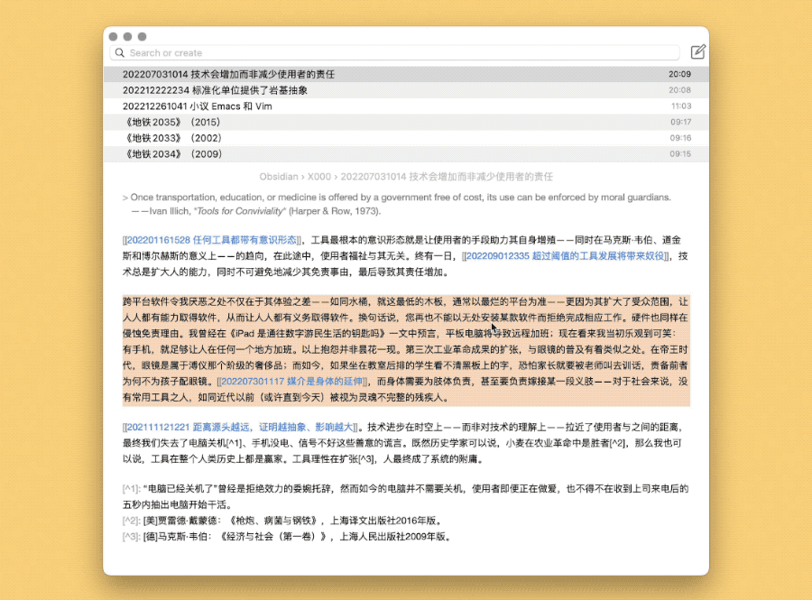

# Refactor Note 拆分笔记

20260412 更新：将 `202604121519 所选文本` 作为默认笔记名，降低输入量。习惯不同的读者，可调整 AppleScript 代码中的 `timestamp & " " & the clipboard` 部分。

一种将当前所选内容拆分为新笔记的方案，类似于 Obsidian 中的 Refactor 插件。

出处：[《笔记扦插：一种笔记的园艺》](https://utgd.net/article/21109/)。

