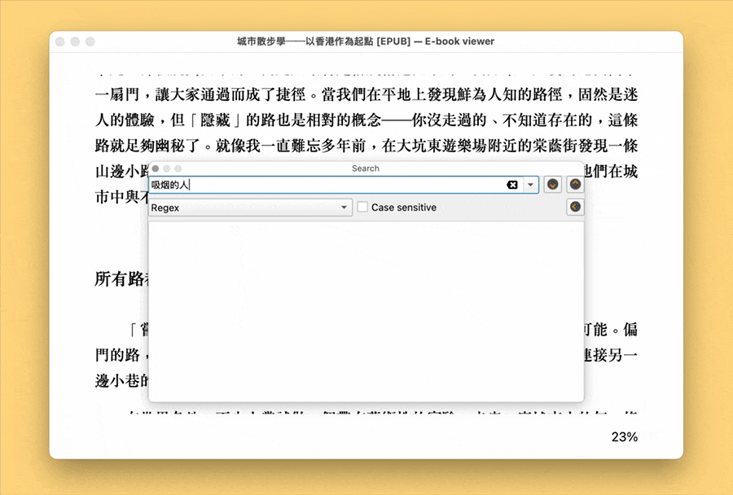

# 繁简同搜

在搜索框中使用，将当前输入的关键词转换为 `简体|繁体` 的形式，以便同时搜索简体和繁体内容。默认需求为输入简体、同时搜索繁体和简体，调换 Swift 脚本中的 `Hans` 和 `Hant` 即可实现反向转换。

目标软件需支持正则表达式。可调整最后一步，以得到符合其他搜索语法的表达式，例如在 Finder 中，应使用 `"简体" OR "繁体"`。

出处：[《如何只输入一次，即可同时搜索简体和繁体内容》](https://utgd.net/article/21275/)。

