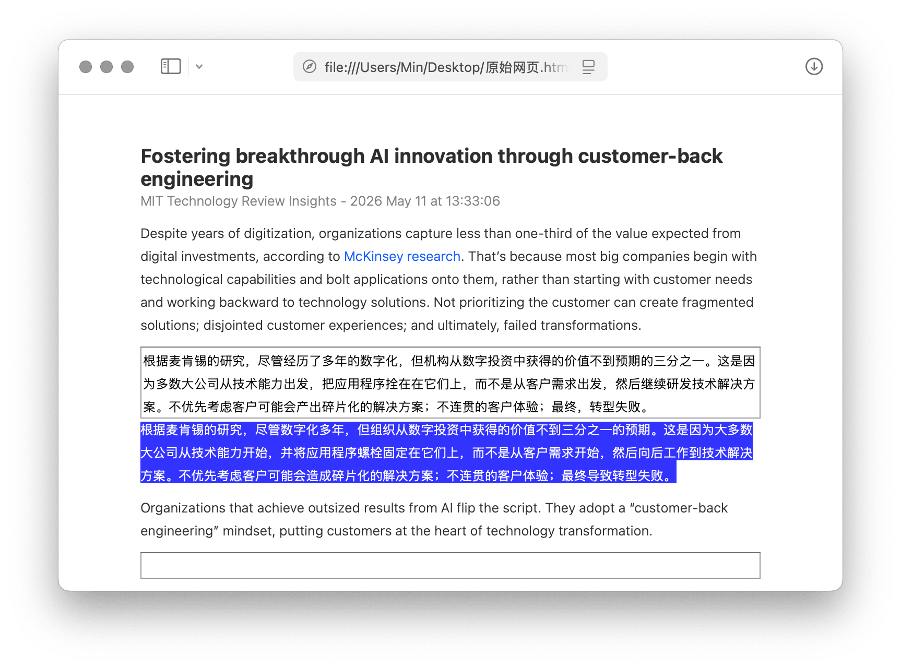

# 网页文章生成翻译习题

需配合[对照翻译工具](https://utgd.net/article/4991)使用，可将当前页面转换为离线存储的习题 HTML 文件，一段原文，一段输入框，一段暂时调成白色、用光标选中方能显示的译文，读一段，译一段，核一段。

使用其他翻译工具的读者，请注意对照排版是否基于 `translate="no"` 特性。利用其他特性完成排版的，本方案可能无法直接使用。

除保存步骤外，本方案主要使用 Javascript，可直接移植到 Agent 或多数自动化工具中。

出处：《把任何外文网页变成交互式翻译习题，还能离线保存》，发布时间未定。

